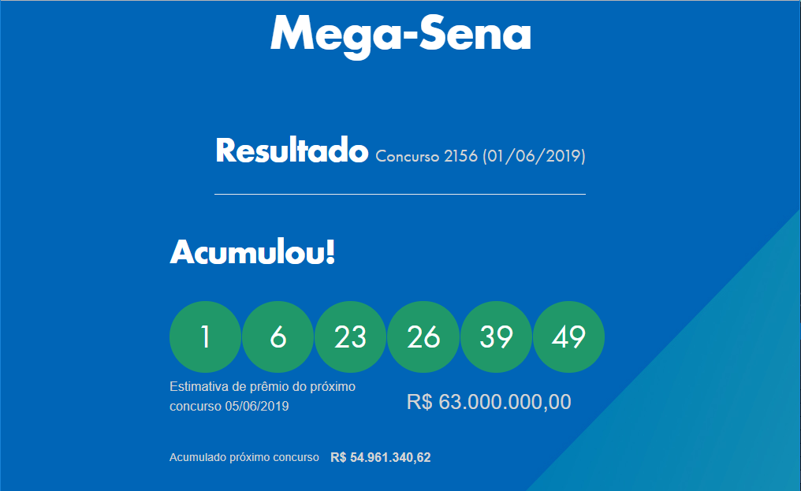

# SuperMídia Widgets

Os widgets são arquivos containers (HTML, CSS, JS) que proporcionam diversos novos layouts e funcionalidades para a SuperMídia.

Nomeclatura: `{Nome}_V1.0.smxwid`  
Diretório de armazenamento: [Arquivos](http://az01.simix.com.br:81/Arquivos/) (Pasta SuperMidia\Widgets)

## Bibliotecas

[Animações CSS](_Libraries/ANIMATIONS.md)

## Layouts disponíveis

Crie um novo partir do nosso [Template](Template) com o [VS Code](https://code.visualstudio.com/).

| Nome                     | Download                                                                                          | Id  |Preview                                 |
|:------------------------:|:-------------------------------------------------------------------------------------------------:|:---:|:--------------------------------------:|
|[Loterias](Loteria)       | [v1.5](http://az01.simix.com.br:81/Arquivos/Arquivos/SuperMidia/Widgets/Loterias_V1.5.smxwid)     | ?   |      |
|[Redes sociais](Posts)    | [v1.10](http://az01.simix.com.br:81/Arquivos/Arquivos/SuperMidia/Widgets/Post_V1.10.smxwid)       | ?   |        |

## Referências
- [Outros conteúdos SuperMídia](http://inst.supermidiadigital.com.br/site/conteudos/)
- [CodePen](https://codepen.io/)
